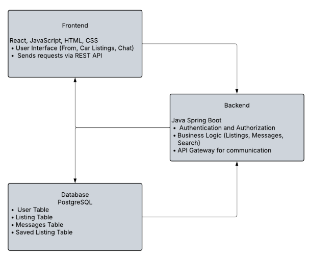

# carHaven
CarHaven is a new car buying platform for college students. It provides a simple interface that makes it easy to find cars nearby that are in a college kids price range, and provides a FAQ page that details the steps needed to buy a car in Cuyahoga County. We also made a price score model for every car, whcich shows how good of a deal the price is, which makes it easier for less knowledgable people to navigate the used car market

I don't know how to run the app without using replit? But if we're ok with using replit then: Link your GitHub account to replit, select this repo to open in replit. That should automatically be able to run all of the files, which you can do by simply clicking run, and that will load the website in the preview window. Then you can run it in its own tab by clicking the new tab button

We made this software with the goal to be as easy to use as possible. There is a big sign in/register button that you need to press to log in/register the first time, to be able to buy or sell cars. Then there is the search and sell buttons in the top middle of the home screen. Sell takes you to a my listings page where you can put in the car you want to sell's details. It also takes you to your profile that lists all of the cars you liked, and allows you to update your profile information. Then the Search Cars button takes you to the main listings page for all of the cars on sale. The top of the page has all of the filters, Price, Make, and Model, then advanced filters for more unique features, mileage, or age. Then the main listing page has brief details for each of the cars, and 3 buttons you can press. One that takes you directly to the contact page for the seller, one that allows you to see more details about the car, and one that adds the car to your liked cars list. We tried to keep all of those features as simple and easy to understand and access as possible. Finally, the last major feature to access is the Financing and Buying Guide, which is just a FAQ page about how to buy a car in Cuyahoga County which can be accesssed by simply clicking on that tab on the top of the screen

WaitlistWizard was the head folder for almost all of our code. Under that, the server folder holds most of our important connections, to the database, to port to the server, and backend stuff. The majority of our code is in client/src and further down. In src/pages, all of the main pages are there, car-detail, car-listing, home-page, etc. Then in src/lib there are a few helper functions, that create the car price score, or other helpful functions. Similar in src/hooks has more helpful functions like toast which helps with user inputs. Then src/components contains the rest of our code, in 5 folders: car, which contains features relating to selling, viewing, and sorting cars, Home, which contains all of the additional features on the home screen, layout, which has the code for the header and footer for each of the pages, messages, which only has message-threads, which links with the message-page file under pages to create the functionality of sending messages, and finally ui, which has a ton of small folders that allowed us to add little features like the like button, and helped with the layot of the search page, or the dropdown menus. ##Talk About TESTS

We used mostly TypeScript for the front end, with drizzleORM, postgreSQL, and radixUI for the backend and database ##???

We started with relatively "strict" roles for each of us, Deep with the front end, Danny with the database, and Attiksh with the backend, but we turned more into Deep doing most of the building, Danny doing most of the de-bugging and tweaking for small features, and some backend, and Attiksh managing us, keeping us on track, and doing most of the write-ups, but ultimately we would each fill in working on someone else's "role" whenever help was needed.

I feel like our development was pretty effecient, we were forced to do a bit of work every week because of all of the demos and meetings and whatnot, and we added and polished a lot of features. We had some struggles linking all of the DB with the front end and backend for a while in the semester, so it would be a lot easier to do the project over again knowing how to do that, but you could probably say that about a lot of projects. I think we had a relatively simple goal for our project and stayed focused, so having to do all of the additional reports seemed mostly to just slow us down and take time away from development time, however, if a group had a more convoluted project that needed help being kept on track, I can see the use for all of them. 

#Liscense@Liscense.com?????
